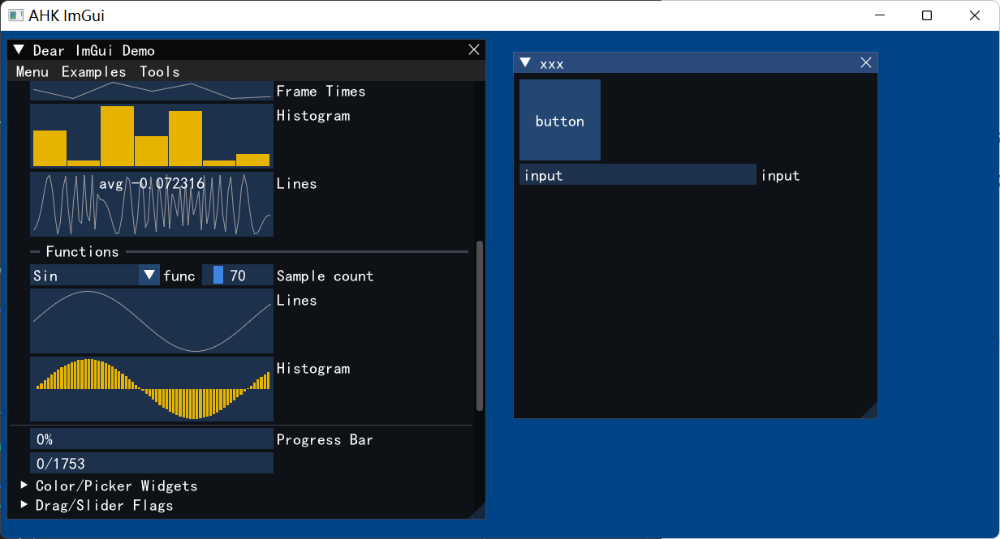

# cimgui-ahk

Auto generated ahk wrapper for Dear ImGui via cimgui

It comes with a default backend with win32 dx11

It works on , windows(x64)

## Current solution is:
1. Use cimgui's json generate function and struct definition
2. The type system supports the ctypes library by thqby

## run
1. There are several demos that can be executed here
2. If it does not work, you need to check whether the dx11 library is installed
  
